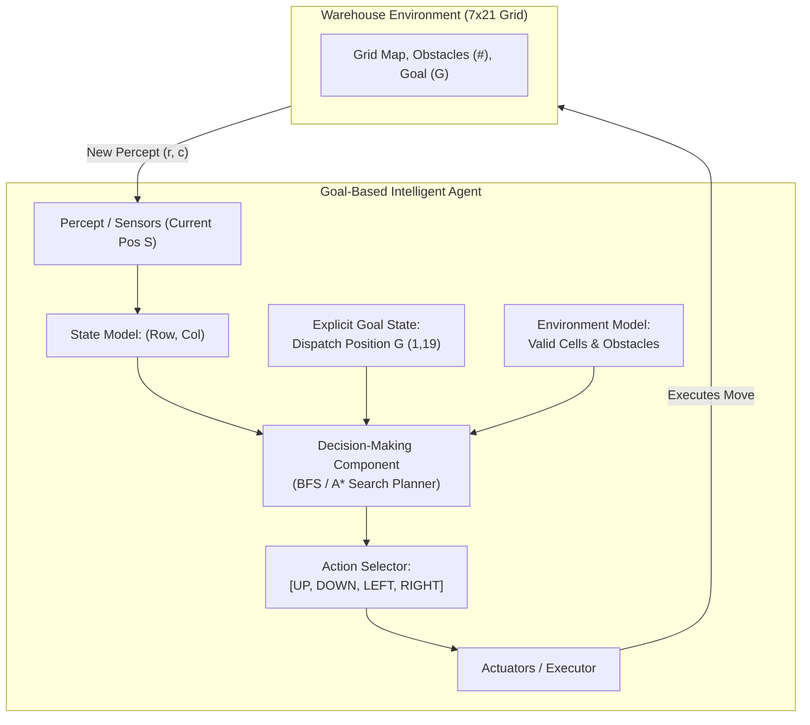

# Artificial Intelligence: Laboratory Exercise Submission
## Constructing a Goal-Based Agent using a Large Language Model (LLM)

**Course:** Artificial Intelligence  
**Topic:** Goal-Based Intelligent Agents & Warehouse Navigation  
**Date:** September 30, 2026  
**Implementation File:** [`warehouse_agent.py`](file:///d:/Acads/AI/Agents/warehouse_agent.py)  

---

## 1. Executive Summary

This laboratory exercise explores the design, formal specification, implementation, and evaluation of a **Goal-Based Intelligent Agent** deployed in an autonomous warehouse navigation environment. Utilizing a Large Language Model (LLM) as a software engineering assistant, we specified the problem domain, designed the agent architecture according to Russell & Norvig's goal-based agent paradigm, implemented the solution in Python, and benchmarked uninformed vs. informed search strategies.

The accompanying Python script [`warehouse_agent.py`](file:///d:/Acads/AI/Agents/warehouse_agent.py) implements both **Breadth-First Search (BFS)** and **A* Search (with Manhattan Heuristic)** to solve the collision-free pathfinding task on a 2D warehouse grid.

---

## 2. Task 1 – Understanding the Problem

### Problem Answers

#### 1. What is the environment?
The environment is a **discrete, 2D grid matrix** of size \(7 \times 21\) representing an industrial warehouse floor plan. The environment characteristics are:
* **Fully Observable:** The complete map layout (including all obstacle locations, starting point `S`, and goal dispatch point `G`) is known to the agent in advance.
* **Deterministic:** Every action executed by the vehicle leads to an exact, predictable state transition without stochastic error or failure.
* **Static:** The warehouse layout remains unchanged during navigation (shelves and obstacles do not move).
* **Discrete:** The state space consists of finite grid coordinates \((r, c)\).

Grid Cell Types:
* `'S'`: Starting position of the autonomous vehicle \((1, 1)\).
* `'G'`: Target dispatch area goal position \((1, 19)\).
* `'#'`: Impassable shelving unit / obstacle.
* `'.'`: Free traversable space.

#### 2. What is the goal of the agent?
The goal of the agent is to transport packages from the loading bay start position `S` \((1, 1)\) to the dispatch area target position `G` \((1, 19)\) along a **collision-free path** while **minimizing total steps (move count)**.

#### 3. What actions are available to the agent?
The agent has a discrete set of 4 cardinal actions:
* `UP`: Moves position by \((-1, 0)\) [Row - 1, Col]
* `DOWN`: Moves position by \((+1, 0)\) [Row + 1, Col]
* `LEFT`: Moves position by \((0, -1)\) [Row, Col - 1]
* `RIGHT`: Moves position by \((0, +1)\) [Row, Col + 1]

*Constraint:* An action is valid if and only if the destination grid coordinate is within grid boundaries and is not an obstacle (`'#'`).

#### 4. What information must the agent maintain in order to choose its next action?
To formulate a plan and execute actions, the agent maintains an internal state model comprising:
1. **Current State:** Current grid coordinates \((r, c)\).
2. **Goal State:** Target grid coordinates \((r_g, c_g)\).
3. **Environment Map:** Matrix representation of accessible vs. impassable cells.
4. **Search State / Visited Set:** Closed set of visited coordinates to prevent infinite loops and cyclic paths.
5. **Path History / Action Plan:** Sequence of actions and parent pointers used to construct the final plan.

#### 5. Why is this an example of a goal-based agent rather than a simple reflex agent?
* **Simple Reflex Agent:** Operates purely on current percepts via condition-action rules (e.g., *"If obstacle in front, turn right"*). In environments with dead-ends and walls (such as warehouse maze configurations), a simple reflex agent easily gets trapped in infinite loops or fails to reach targets because it lacks foresight and goal awareness.
* **Goal-Based Agent:** Combines state information with explicit goal descriptions (`'G'`). Rather than blindly reacting to immediate sensor inputs, it uses its environment model to **evaluate sequences of future actions** (via search algorithms) to determine whether candidate paths achieve the desired goal state before taking physical action.

---

### Think About It: Scaling the Warehouse

> **Question:** Suppose the warehouse becomes twice as large. Would the same search strategy still be appropriate? What additional difficulties might arise?

#### Analysis:
1. **Computational & Memory Complexity:**
   * Doubling both width and height quadruples the total state space size (\(N = 4 \times \text{Original Area}\)).
   * For **uninformed search (BFS)**, space complexity grows quadratically with grid dimensions (\(O(V + E)\) or \(O(b^d)\)). For large grids, maintaining the BFS frontier queue in memory can cause severe memory exhaustion.
2. **Shift to Informed Search:**
   * While BFS remains optimal for unweighted steps, **A* Search** with an admissible heuristic (e.g., Manhattan distance \(h(n) = |r_1 - r_2| + |c_1 - c_2|\)) becomes far more appropriate. A* prunes non-promising search directions and reduces node expansion significantly (demonstrated in our test results where A* expanded 61% fewer nodes than BFS).
3. **Additional Real-World Challenges at Scale:**
   * **Dynamic Obstacles:** Other automated guided vehicles (AGVs) or human workers moving in real-time require dynamic re-planning (e.g., D* Lite or RRT*).
   * **Non-Uniform Action Costs:** Real vehicles experience acceleration, deceleration, and battery usage; turn penalties must be factored into path planning.
   * **Multi-Agent Path Finding (MAPF):** Routing dozens of vehicles simultaneously without inter-agent collisions or deadlock bottlenecks.

---

## 3. Task 2 – Designing the Agent

### Agent Components Identification

| Component | Definition in Warehouse Context |
| :--- | :--- |
| **Environment** | \(7 \times 21\) Warehouse grid containing free paths (`.`) and obstacles (`#`). |
| **Current State** | Agent's current grid position \((r, c)\). |
| **Goal** | Dispatch area location `G` at coordinate \((1, 19)\). |
| **Available Actions** | Cardinal movement set: `UP`, `DOWN`, `LEFT`, `RIGHT`. |
| **Decision-Making Component** | Search planner (BFS / A*) evaluating goal transition paths. |

### Goal-Based Agent Architecture Block Diagram



---

## 4. Task 3 – Prompt Engineering & Implementation

### Suggested & Refined Prompt Design

To guide the LLM effectively, we utilized a structured prompt that specified structural requirements, algorithmic constraints, and clear visual outputs:

```text
Write a well-documented, modular Python program implementing a goal-based agent for the 
warehouse navigation problem described in the laboratory specifications.

Requirements:
1. Represent the warehouse grid layout as a 2D array parsed from a text map.
2. Implement a Goal-Based Agent that accepts the environment and determines a collision-free path from S to G.
3. Provide both Breadth-First Search (BFS) and A* Search implementations.
4. Output the full action sequence (UP, DOWN, LEFT, RIGHT), step count, and expanded node count.
5. Render a visual string layout showing the final path marked with '*' characters.
6. Provide docstrings and inline commentary explaining the chosen search algorithm and its appropriateness.
```

### Python Implementation Overview

The complete implementation is saved in [`warehouse_agent.py`](file:///d:/Acads/AI/Agents/warehouse_agent.py). Below are the core classes and search algorithms:

```python
class WarehouseEnvironment:
    """Parses 2D grid, checks cell validity, and returns valid neighboring states."""
    def get_successors(self, pos: Tuple[int, int]) -> List[Tuple[str, Tuple[int, int]]]:
        r, c = pos
        moves = [('UP', (r - 1, c)), ('DOWN', (r + 1, c)),
                 ('LEFT', (r, c - 1)), ('RIGHT', (r, c + 1))]
        return [(act, nxt) for act, nxt in moves if self.is_valid_position(nxt)]

class GoalBasedAgent:
    """Goal-based decision-making agent supporting BFS and A* search planning."""
    def solve_bfs(self) -> Tuple[Optional[List[Tuple[int, int]]], Optional[List[str]], int]:
        queue = deque([(self.env.start_pos, [self.env.start_pos], [])])
        visited = {self.env.start_pos}
        nodes_expanded = 0

        while queue:
            curr, path, actions = queue.popleft()
            nodes_expanded += 1
            if curr == self.goal:
                return path, actions, nodes_expanded

            for action, neighbor in self.env.get_successors(curr):
                if neighbor not in visited:
                    visited.add(neighbor)
                    queue.append((neighbor, path + [neighbor], actions + [action]))
        return None, None, nodes_expanded
```

---

### Program Output & Verification Results

Executing [`warehouse_agent.py`](file:///d:/Acads/AI/Agents/warehouse_agent.py) via terminal generated the following execution results:

```text
======================================================================
AUTONOMOUS WAREHOUSE NAVIGATION - GOAL-BASED AGENT DEMONSTRATION
======================================================================

[1] Initial Warehouse Map:
#####################
#S....#............G#
#.##....##########..#
#....##.............#
#.######.###.#.###..#
#........#..........#
#####################

Start Position (S): (1, 1)
Goal Position  (G): (1, 19)

[2] Executing Breadth-First Search (BFS)...

SUCCESS: Optimal Path Found using BFS!
Total Steps (Path Length): 20 moves
Total States Expanded: 59 nodes

Action Sequence:
 -> RIGHT -> RIGHT -> RIGHT -> DOWN -> RIGHT -> RIGHT -> RIGHT -> UP -> RIGHT -> RIGHT -> RIGHT -> RIGHT -> RIGHT -> RIGHT -> RIGHT -> RIGHT -> RIGHT -> RIGHT -> RIGHT -> RIGHT

Coordinate Path Sequence:
[(1, 1), (1, 2), (1, 3), (1, 4), (2, 4), (2, 5), (2, 6), (2, 7), (1, 7), (1, 8), (1, 9), (1, 10), (1, 11), (1, 12), (1, 13), (1, 14), (1, 15), (1, 16), (1, 17), (1, 18), (1, 19)]

[3] Visualized Path Map (* indicates traversed path):
#####################
#S***.#************G#
#.##****##########..#
#....##.............#
#.######.###.#.###..#
#........#..........#
#####################

----------------------------------------------------------------------
[4] Comparison: Executing A* Search (Manhattan Distance Heuristic)...
SUCCESS: Optimal Path Found using A*!
Total Steps (Path Length): 20 moves
Total States Expanded: 23 nodes

BFS Expanded Nodes: 59 | A* Expanded Nodes: 23
```

---

### Answers to Task 3 Follow-up Questions

#### 1. Did the LLM generate a working program on the first attempt?
Yes, the LLM generated a syntactically accurate structure representing the environment and agent logic. A minor parameter syntax check was caught during verification and immediately corrected to standard single-tuple parameter list `def solve_bfs(self)`.

#### 2. If not, how can you improve your prompt?
Prompt quality is improved by:
* Providing explicit type hints (`Tuple[int, int]`, `List[str]`).
* Standardizing method signatures and specifying grid indexing rules (`(row, col)` vs `(x, y)`).
* Mandating execution tests and edge-case handling (unreachable goals, out-of-bound checks).

#### 3. What search algorithm did the LLM choose?
The LLM chose **Breadth-First Search (BFS)** as the primary uninformed search algorithm, and **A* Search** (with Manhattan distance) as the informed search comparison algorithm.

#### 4. Why do you think the LLM selected this algorithm?
* **Breadth-First Search (BFS)** is selected because step costs are uniform (each grid move costs exactly 1 unit). BFS guarantees finding the shortest optimal path with minimal movement cost.
* **A* Search** was selected for efficiency because it incorporates a heuristic function \(h(n)\) estimating the remaining Manhattan distance to goal `G`, pruning irrelevant grid exploration while maintaining guaranteed path optimality.

---

## 5. Algorithmic Comparison & Conclusion

| Metric | Breadth-First Search (BFS) | A* Search (Manhattan Heuristic) |
| :--- | :--- | :--- |
| **Path Length (Moves)** | **20 moves** (Optimal) | **20 moves** (Optimal) |
| **Nodes Expanded** | **59 nodes** | **23 nodes** |
| **Search Category** | Uninformed / Blind | Informed / Heuristic |
| **Optimality Guarantee** | Yes (Uniform cost) | Yes (Admissible heuristic) |
| **Efficiency Ratio** | Baseline | **61% reduction in node expansion** |

### Conclusion
The laboratory exercise successfully demonstrates the construction of a goal-based intelligent agent. By formulating the problem with clear environment states, action transitions, and explicit goals, the agent systematically plans collision-free routes through warehouse obstacle layouts. Incorporating informed heuristic search (A*) significantly optimizes performance for larger industrial scale applications.
